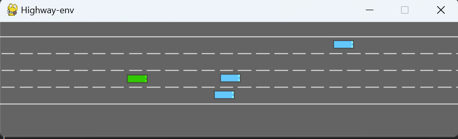
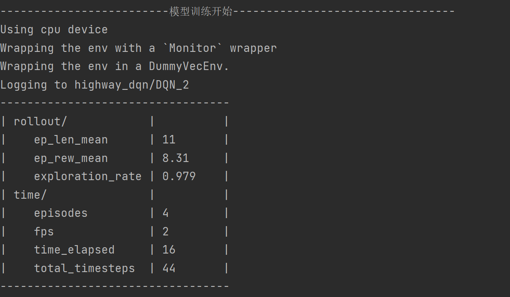
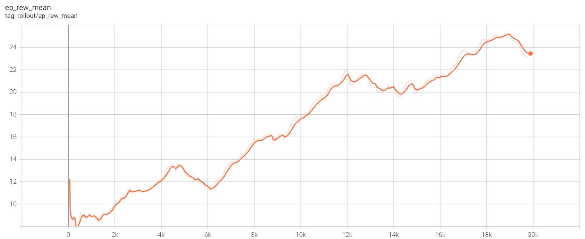

## 1 算法介绍

此项目采用经典的强化学习算法（ DQN（Deep Q-Network）算法）实现自动驾驶车辆在高速公路（highway）上的决策任务。

### 1.1 概述

DQN（深度 Q 网络）是一种用于强化学习的算法，将传统的 Q-learning 算法与深度神经网络相结合。

强化学习的目标是让智能体（agent）通过与环境的交互来学习最优的决策策略，以最大化累计奖励。
DQN 通过使用深度神经网络来逼近 Q 值函数，使得算法能够在复杂的高维状态空间中工作，例如视频游戏或自动驾驶中的感知问题。

### 1.2 相关原理

DQN 基于 Q-learning算法进行改进，是一种值函数方法，用于估计状态-动作对（state-action pair）的期望未来奖励。Q-learning 使用 Q 值函数
Q(s,a) 来表示在状态
s 下执行动作
a 能获得的预期累积奖励。

#### 1.2.1 Q-learning

Q-learning 是一种强化学习算法，属于值函数方法。它的目标是找到一种策略，使得智能体在每一个状态下选择的动作能够最大化其预期的累积奖励。

Q-learning 通过学习一个 Q 函数（Q-table 或 Q-value function），这个函数接受一个状态和一个动作作为输入，输出一个值（Q 值），表示在这个状态下执行这个动作能够获得的预期奖励。

Q-learning 的更新公式为：

$$
Q(s, a) \leftarrow Q(s, a) + \alpha \left[ r + \gamma \max_{a'} Q(s', a') - Q(s, a) \right]
$$

其中：

* s 是当前状态
* a 是当前动作
* r 是执行动作 a 后得到的奖励
* s' 是执行动作 a 后的下一状态
* α 是学习率，控制更新速度
* γ 是折扣因子，控制未来奖励的重要性

但是在普通的Q-learning中，当状态和动作空间是离散且维数不高时可使用Q-Table储存每个状态动作对的Q值，而当状态和动作空间是高维连续时，使用Q-Table不动作空间和状态太大十分困难。
因此，DQN在Q-learning的基础上进行改进。

#### 1.2.2 深度 Q 网络（DQN）

DQN 使用一个深度神经网络（Q 网络）来逼近 Q 值函数。神经网络的输入是状态 𝑠 ，输出是所有可能动作的 Q 值
𝑄(𝑠,𝑎;𝜃)，其中 𝜃 是神经网络的参数。

为了稳定训练过程，DQN 引入了两个关键技术：

* 经验回放（Experience Replay）：智能体在与环境交互的过程中，会生成大量的经验数据（状态、动作、奖励、下一个状态）。这些数据被存储在一个固定大小的回放缓冲区中。在训练过程中，DQN 会随机抽取一个小批量的经验进行训练。这种做法打破了经验之间的时间相关性，提高了训练的稳定性。
* 目标网络（Target Network）：DQN 维护两个神经网络：当前 Q 网络（用于选择动作和更新 Q 值）和目标 Q 网络（用于计算目标 Q 值）。目标 Q 网络的参数每隔一定步数从当前 Q 网络复制而来，避免了网络参数频繁更新带来的不稳定性。

### 1.3 工作流程

1. **初始化：**
   * 初始化当前 Q 网络和目标 Q 网络，并随机初始化它们的参数。
   * 初始化经验回放缓冲区为空。
2. **与环境交互：**
   * 在每个时间步 𝑡 ，智能体根据当前 Q 网络的输出和 ε-greedy 策略选择动作。即，以 ε 的概率选择一个随机动作（探索），以
     1 − 𝜖 的概率选择当前 Q 网络输出的最大 Q 值对应的动作（利用）。
   * 执行动作 𝑎 ，获得奖励
     𝑟 和下一个状态 𝑠′。
   * 将经验(𝑠, 𝑎, 𝑟, 𝑠′)存储到回放缓冲区。
3. **经验回放：**
   * 从回放缓冲区中随机抽取一个小批量的经验(𝑠, 𝑎, 𝑟, 𝑠′)
     进行训练。
   * 对于每个经验，计算目标 Q 值 𝑦 ：

$$
y = r + \gamma \max_{a'} Q(s', a'; \theta^{-})
$$

其中，
𝑄(𝑠′,𝑎′;𝜃−)是目标网络给出的 Q 值，𝜃−表示目标网络的参数

4. **更新 Q 网络：**
   * 使用梯度下降法最小化当前 Q 网络输出的 Q 值与目标 Q 值之间的均方误差（MSE）：

$$
L(\theta) = \mathbb{E} \left[(y - Q(s, a; \theta))^2\right]
$$

* 计算损失并更新当前 Q 网络的参数𝜃。

5. **更新目标网络：**
   
   * 每隔一定步数，将当前 Q 网络的参数 𝜃 复制到目标网络的参数 𝜃− 。
6. **重复：**
   
   * 重复步骤 2 到步骤 5，直到达到最大训练步数或其他终止条件。

## 2 本地部署

注意：

Stable-Baselines3 支持 PyTorch >= 1.13。

Stable-Baselines3的安装需要 Python 3.8+。

**文档说明：**

* main.py #主文件
* utils 文件夹
  * train.py #模型训练
  * evaluate.py #模型评估
  * visualize.py #可视化
* ReadMe.md #文档

### 2.1 虚拟环境配置

```
conda create -n env_name python=3.8 # 安装虚拟环境
activate env_name
pip install stable-baselines3[extra] # 安装stable—baseline3
pip install highway-env==1.8.2
pip install gym
pip install gymnasium==0.29.1
```
### 2.2 具体步骤

#### 2.2.1 模型训练

train (env_name, total_timesteps=20000, save_path="highway_dqn/model")

```
使用 Stable-Baselines3 训练 DQN 模型。

* env_name: 仿真环境名称，在本示例中选用 highway_env 中的 highway-v0
* total_timesteps：训练总步数，根据不同场景训练难度进行调节，默认为20000
* save_path:模型保存路径
* return：利用DQN算法训练好的模型

#### 2.2.2 模型评估
```

evaluate(env_name, trained_model)

```
评估训练好的 DQN 模型性能。

* env_name:Gym 环境名称，例如 "highway-v0"。
* model：训练好的 DQN 模型

#### 2.2.3 模型预测与可视化
```

visualize(env_name, model, step_num = 100)

```
使用训练好的 DQN 模型进行预测并用highway_env 进行可视化。

* env_name:Gym 环境名称
* model：训练好的 DQN 模型
* step_num: 预测的仿真步数，默认为 100 步。

模型训练与评估阶段的 average reward，average length，learning_rate 和 loss 等图可以打开tensorboard查看。

在终端输入如下代码打开：
```

tensorboard --logdir “训练模型log存储地址”

```
_注意：存储地址需要绝对路径_

## 3 完整Demo
```

from train import train
from evaluate import evaluate
from visualize import visualize

# 环境选择

env_name = 'highway-v0'

# 模型训练

trained_model = train(env_name, total_timesteps=20000)

# 模型评估

evaluate(env_name, trained_model)

# 模型可视化

visualize(env_name, trained_model, step_num=100)
```
仿真环境如下图：

<p align="center">
  
</p>

模型训练过程如下：

<p align="center">
  
</p>

在highway-v0环境下进行20000次训练的平均奖励图如下所示：

<p align="center">
  
</p>

# highway_RL
